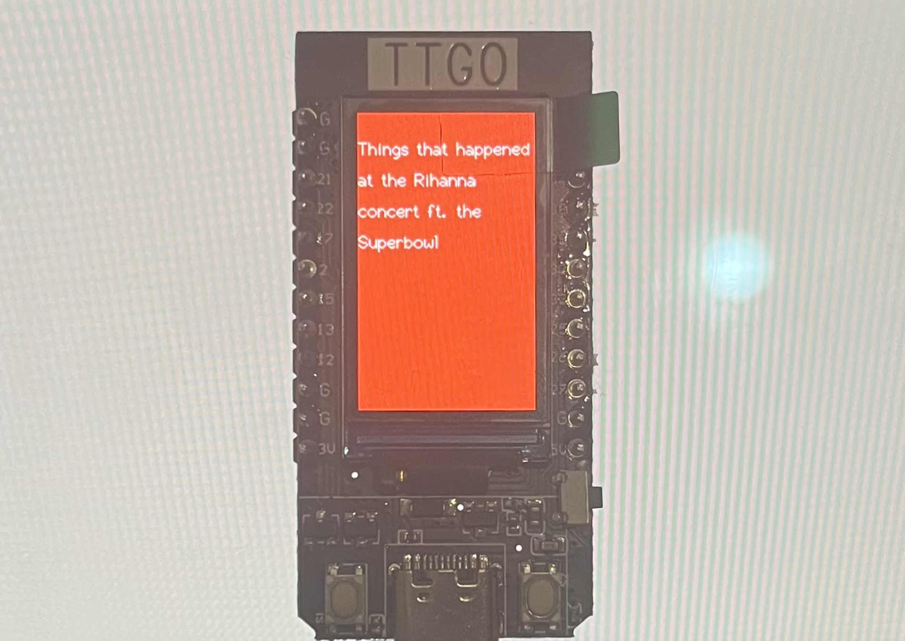

# esp32-rihanna-scroll
A visual project for the ESP32 TTGO T-Display which scrolls text relating to Rihanna's Super Bowl halftime performance.

## Set Up
For this project, you will need an ESP32 TTGO T-Display. I will be using the Arduino IDE in order to upload this project onto the ESP32. 

1. To set up the Arduino IDE environment, follow the instructions in the demo [here](https://www.youtube.com/watch?v=adLUgmCJKnM).
- Some issues that came up for me in setting up this environment included lack of dependencies (e.g. python) and the upload speed. For example, I found that I had to lower my upload speed to 115200. Keep these in mind and make changes accordingly if you come across any issues when following the demo -- the output should let you know.
2. Clone this project and open it up in the Arduino IDE.
3. Connect to your ESP32. Make sure that you select your board on the top left. 
4. Upload your code and voilà! You should now see the scrolling text on your ESP32. 
